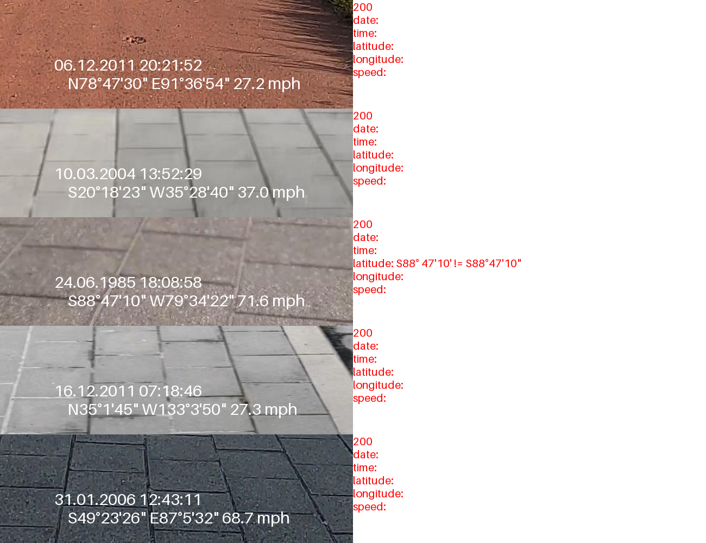

# OCR Model for Sensor Information Extraction from Self-Driving Vehicle Captions

## Introduction

This project demonstrates the use of an OCR model to parse and extract sensor information such as GPS coordinates, timestamp, and speed from images containing captions of self-driving vehicles. The workflow involves generating fake sensor data, overlaying it on images, and then using an OCR model to extract and structure the data.

The Phi-3 OCR model is effective but does not support structured output directly. Therefore, you should pipe its output to another LLM model capable of structuring the data. In this project, we use the llama3 model with Ollama, so installing Ollama is necessary. Installation steps are provided below.

For testing, the [sidewalk semantic dataset from Huggingface](https://huggingface.co/datasets/segments/sidewalk-semantic) is used. This dataset has various backgrounds, which sometimes leads to incorrect model results. Common issues include:
- Incorrect spacing, e.g., `DD °MM'SS"` instead of `DD°MM'SS"`.
- Incorrect symbols for latitude and longitude, e.g., `DD°MM'SS'` instead of `DD°MM'SS"`.

Despite these, the model generally performs well.

## Output Example

The output displays in a `prediction == target` format when mismatches occur.



## Overview

The project consists of the following steps:

### Fake Sensor Data Generation
Using the `faker` library, generate realistic sensor data, including latitude, longitude, date, time, and speed.

### Text Overlay on Images
Format and draw the generated sensor data onto images using Pillow.

### OCR Model
A pre-trained OCR model (Phi-3-vision-128k-instruct) extracts unstructured text from the images.

### LLM Chain
Process the extracted text using a language model (Ollama's llama3) to convert it into structured data.

### Evaluation
Compare the extracted and structured data with the original sensor data to evaluate accuracy.


## Installation

You should install Ollama:
```bash
curl -fsSL https://ollama.com/install.sh | sh
```

Download the llama3 model:
```bash
ollama pull llama3
```

install torch ( for installing other version of torch, [torch installation](https://pytorch.org/get-started/locally/) )
```bash
pip install torch torchvision torchaudio --index-url https://download.pytorch.org/whl/cu121
```


Install the required Python packages:
```bash
pip install -r requirements.txt
```

you should install flash-attn
```bash
pip install flash-attn --no-build-isolation
```

## Run
You can execute `main.py` interactively.


